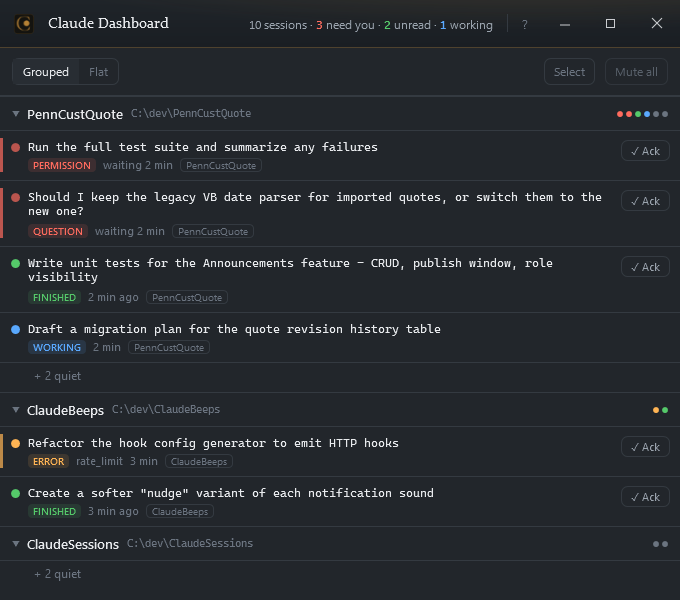

# Claude Dashboard

Stop babysitting your terminal. Claude Dashboard gives you sound and visual notifications when a long-running Claude Code agent finishes its turn, so you can context-switch freely without letting critical tasks stall.

A Windows tray application for developers running many concurrent Claude Code sessions. It answers, at a glance, the three questions a wall of terminals can't: **what needs me right now**, **what finished that I haven't seen**, and **what's still working**.



**Status:** Phase 1 is building. The tray app runs, ingests Claude Code hooks, and shows the panel above; the design, specifications, and a phased execution plan are done. Windows integration — click-to-navigate, focus acknowledgment, virtual-desktop grouping — begins at Phase 2.

## What it does

- A single resident tray app whose icon is an overall **status light** (red needs-you · amber error · green unread · blue working · grey quiet), rolled up from every session.
- A panel that sorts sessions into **attention bands** — needs-you (oldest first), unread (newest first), working, quiet — grouped by working directory, with each row showing the prompt *and*, when finished, the answer, so most checks resolve without switching to the terminal.
- **Sound that carries meaning.** Four distinct notices — permission, question, error, finished — so a beep tells you what happened before you look at anything. A nudge re-raises something still waiting, and any of it can be silenced: every session, the next thirty minutes, or one session on its own.
- **Group related sessions, and the group chimes as one.** Sessions working one job — agents passing messages back and forth, or parallel runs across repositories — go quiet as individuals: no chime per handoff, none per member to count. You hear a single notice when the last one finishes, however many there are and whatever order they land in.
- Its world is **event-sourced from Claude Code hooks** — it never polls, and it never blocks a Claude turn (hooks are pure observers).
- Later phases add click-to-navigate to the right terminal tab, focus-based acknowledgment, virtual-desktop grouping, searchable history, and a phone view.

## Install

**Pre-release.** Version 0.0.9 is an early build: it works on the developer's machine and has not yet been tried on a clean one. Expect rough edges, and please [open an issue](https://github.com/dsopko/claude-dashboard/issues) when you hit one.

**You need:** Windows 10 or 11, 64-bit, and [Claude Code](https://docs.anthropic.com/en/docs/claude-code) installed for the user who will run the dashboard. Nothing else — the .NET runtime is included.

1. Download `dsopko.ClaudeDashboard-win-Setup.exe` from the [releases page](https://github.com/dsopko/claude-dashboard/releases).
2. Run it. **Windows will show "Windows protected your PC"** because the build is not yet code-signed — click **More info**, then **Run anyway**. It installs for your user only, under `%LocalAppData%`, and never asks for administrator rights.
3. Start **Claude Dashboard** from the Start Menu. It runs in the tray; the panel opens from the tray icon.

That is all. On its first start the dashboard adds one hook to your Claude Code settings so it can hear your sessions, and from then on every new Claude Code session reports to it.

**What it touches.** One entry in `~/.claude/settings.json`, a command hook that runs `post-status.cmd` from `%LocalAppData%\ClaudeDashboard`. The hook is a pure observer: it can never block or change a Claude turn, and it does nothing at all when the dashboard is not running. Everything the dashboard records — session state, prompts, answers — stays in a SQLite file in that same folder. It listens on the loopback interface only and sends nothing anywhere.

**Uninstall.** *Settings → Apps → Claude Dashboard → Uninstall* removes the program and leaves your data folder in place. To take the hook out of your Claude Code settings first, run `ClaudeDashboard.App.exe --remove-hooks` from the install folder; without that, the hook stays and is harmless — it finds no dashboard and exits.

**Portable.** The release also carries `dsopko.ClaudeDashboard-win-Portable.zip`: extract it anywhere and run `current\ClaudeDashboard.App.exe`. No Start Menu entry, no Apps entry.

## Documents

Everything lives in [`docs/`](docs/). Read in this order:

| Document | What it is |
|---|---|
| [Design](docs/claude-dashboard-design.md) | Business-level design — the problem, principles, and product shape. |
| [Technical Specification](docs/claude-dashboard-spec.md) | Technology-agnostic architecture and mechanisms (the *why*). Reference for any future non-Windows port. |
| [Implementation Specification](docs/claude-dashboard-impl-spec.md) | The C# / .NET / WPF realization (the *how*) — projects, libraries, APIs, the Claude Code hook contract. |
| [Execution Plan](docs/claude-dashboard-execution-plan.md) | Phased task graph with acceptance criteria, plus agent role prompts (Appendix B). |
| [Mockups](docs/claude-dashboard-mockups.html) | UI reference — open in a browser. |

## Tech stack

C# on **.NET 10 (LTS)**, **WPF**. Three projects behind a portable-core / Windows-host split:

- `ClaudeDashboard.Core` — domain (registry, state machine, attention engine, sound policy) with no WPF/Win32/ASP.NET.
- `ClaudeDashboard.App` — WPF tray UI, loopback ingress (Kestrel), and all Windows integration (UI Automation, WinEvent hooks, virtual desktop) behind interfaces.
- `ClaudeDashboard.Remote` — later, the phone surface.
- `ClaudeDashboard.Tests` — xUnit.

Key libraries: FlaUI (UI Automation), NAudio (sound), H.NotifyIcon (tray), Kestrel minimal API (hook ingress), Microsoft.Data.Sqlite (history), Serilog. Full list in the Implementation Specification, Appendix A.

## How it's built

Development runs as a small agent workflow: a **director** drives the execution plan, dispatching one task at a time to a **coder** and routing each completed change to a **reviewer**, with the human as the escalation point. The role prompts are in the Execution Plan, Appendix B.

## Roadmap

| Phase | Theme |
|---|---|
| 1 | See clearly — the event-driven panel, tray, sound, and ack. **No Windows integration; independently useful and testable without a desktop.** |
| 2 | Go there — click a row, jump to its terminal tab. |
| 3 | It notices — looking at a terminal acknowledges it. |
| 4 | Task lens — grouping by virtual desktop. |
| 5 | Memory — searchable history and wait-time stats. |
| 6 | Polish — settings UI, sound editor, themes. |
| 7 | Anywhere — authenticated phone read/ack. |

## Repository layout

```
claude-dashboard/
├── README.md
├── CLAUDE.md                     # always-loaded project context + orchestration pointer
├── ClaudeDashboard.slnx
├── .gitignore
├── .gitattributes
├── .claude/
│   └── skills/
│       └── dashboard-orchestration/
│           └── SKILL.md          # loadable guide to the director/coder/reviewer workflow
├── src/
│   ├── ClaudeDashboard.Core/     # the domain: state machine, attention ordering, grouping
│   └── ClaudeDashboard.App/      # the Windows host: WPF panel, tray, ingress, adapters
├── tests/
│   └── ClaudeDashboard.Tests/    # xUnit, including the architecture and dependency rules
└── docs/
    ├── claude-dashboard-design.md
    ├── claude-dashboard-spec.md
    ├── claude-dashboard-impl-spec.md
    ├── claude-dashboard-execution-plan.md
    ├── claude-dashboard-mockups.html
    └── claude-dashboard-screenshot.md   # how the README screenshot is retaken
```

`ClaudeDashboard.Core` holds no WPF, Win32 or ASP.NET reference, and nothing references `ClaudeDashboard.App` — a rule the test suite enforces rather than merely states.

## License

[MIT](LICENSE).
