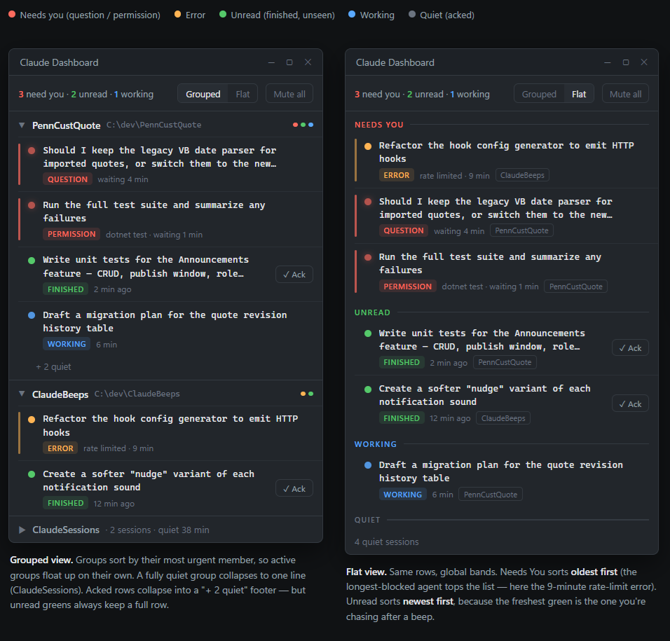

# Claude Dashboard

A Windows tray application for developers running many concurrent Claude Code sessions. It answers, at a glance, the three questions a wall of terminals can't: **what needs me right now**, **what finished that I haven't seen**, and **what's still working** — replacing terminal-hunting and "a beep happened somewhere" with one prioritized, always-visible panel.

**Status:** planning complete, implementation not yet started. The design, specifications, and a phased execution plan are done; code begins at execution-plan task **T1.0**.

## What it does

* A single resident tray app whose icon is an overall **status light** (red needs-you · amber error · green unread · blue working · grey quiet), rolled up from every session.
* A panel that sorts sessions into **attention bands** — needs-you (oldest first), unread (newest first), working, quiet — grouped by working directory, with each row showing the prompt *and*, when finished, the answer, so most checks resolve without switching to the terminal.
* Its world is **event-sourced from Claude Code hooks** — it never polls, and it never blocks a Claude turn (hooks are pure observers).
* Later phases add click-to-navigate to the right terminal tab, focus-based acknowledgment, virtual-desktop grouping, searchable history, and a phone view.

<p align="center">
  
</p>

## Documents

Everything lives in [`docs/`](docs/). Read in this order:

|Document|What it is|
|-|-|
|[Design](docs/claude-dashboard-design.md)|Business-level design — the problem, principles, and product shape.|
|[Technical Specification](docs/claude-dashboard-spec.md)|Technology-agnostic architecture and mechanisms (the *why*). Reference for any future non-Windows port.|
|[Implementation Specification](docs/claude-dashboard-impl-spec.md)|The C# / .NET / WPF realization (the *how*) — projects, libraries, APIs, the Claude Code hook contract.|
|[Execution Plan](docs/claude-dashboard-execution-plan.md)|Phased task graph with acceptance criteria, plus agent role prompts (Appendix B).|
|[Mockups](docs/claude-dashboard-mockups.html)|UI reference — open in a browser.|

## Tech stack

C# on **.NET 10 (LTS)**, **WPF**. Three projects behind a portable-core / Windows-host split:

* `ClaudeDashboard.Core` — domain (registry, state machine, attention engine, sound policy) with no WPF/Win32/ASP.NET.
* `ClaudeDashboard.App` — WPF tray UI, loopback ingress (Kestrel), and all Windows integration (UI Automation, WinEvent hooks, virtual desktop) behind interfaces.
* `ClaudeDashboard.Remote` — later, the phone surface.
* `ClaudeDashboard.Tests` — xUnit.

Key libraries: FlaUI (UI Automation), NAudio (sound), H.NotifyIcon (tray), Kestrel minimal API (hook ingress), Microsoft.Data.Sqlite (history), Serilog. Full list in the Implementation Specification, Appendix A.

## How it's built

Development runs as a small agent workflow: a **director** drives the execution plan, dispatching one task at a time to a **coder** and routing each completed change to a **reviewer**, with the human as the escalation point. The role prompts are in the Execution Plan, Appendix B.

## Roadmap

|Phase|Theme|
|-|-|
|1|See clearly — the event-driven panel, tray, sound, and ack. **No Windows integration; independently useful and testable without a desktop.**|
|2|Go there — click a row, jump to its terminal tab.|
|3|It notices — looking at a terminal acknowledges it.|
|4|Task lens — grouping by virtual desktop.|
|5|Memory — searchable history and wait-time stats.|
|6|Polish — settings UI, sound editor, themes.|
|7|Anywhere — authenticated phone read/ack.|

## Repository layout

```
claude-dashboard/
├── README.md
├── .gitignore
├── .gitattributes
└── docs/
    ├── claude-dashboard-design.md
    ├── claude-dashboard-spec.md
    ├── claude-dashboard-impl-spec.md
    ├── claude-dashboard-execution-plan.md
    └── claude-dashboard-mockups.html
```

The solution and source are added by execution-plan task **T1.0**; until then this repository holds planning artifacts only.

